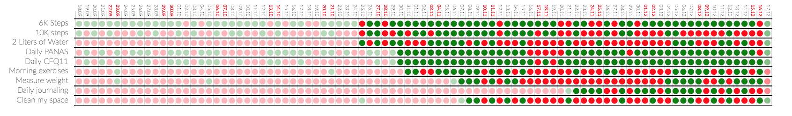
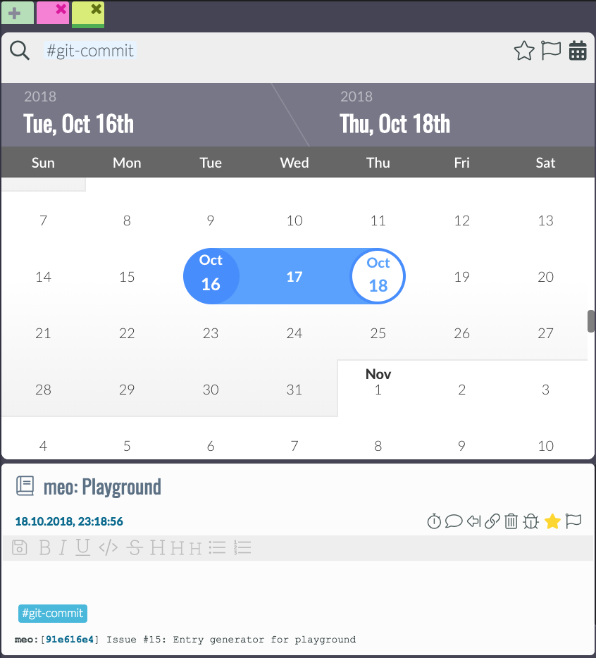
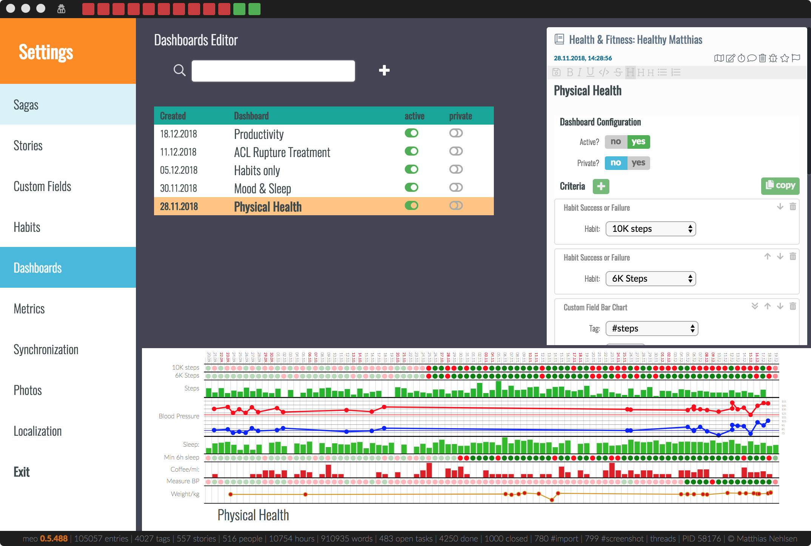
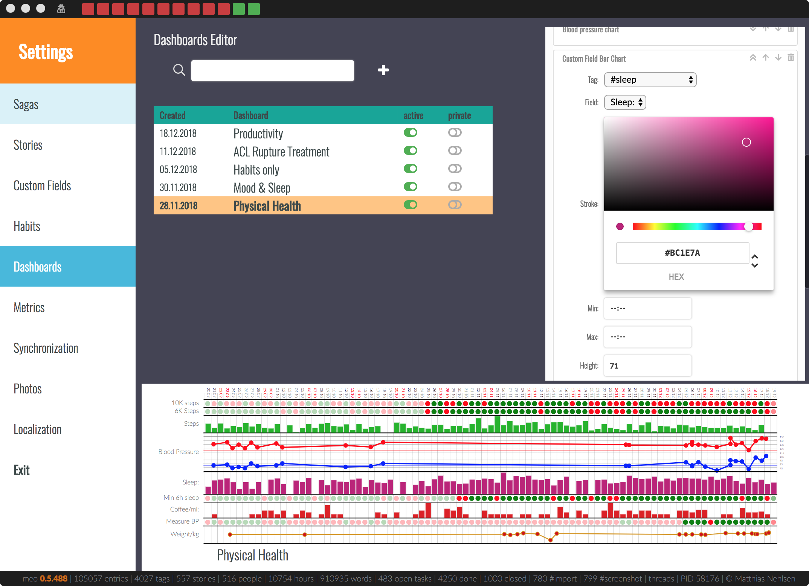

# What is **meo** and how do I **use** it?

**Meo** is a data-driven, multi-platform journal that helps you **get your life in order**. First, you define what you want to capture, e.g., how long you **sleep**, how many **steps** you take, how much **beer** you drink. Variables you have some influence on. Then you define **habits**, where a set of rules determines habit success (or failure). Then you record the data or have meo recorded it for you. A dashboard finally shows you where you **succeed** and where you **fail**. Your only job then is to keep everything **green**, for as long as you possibly can. **Don’t break the chain**, pretty much. Here’s my example of recent success and failure for some of the habits I defined for myself:

 

The dots are only fully saturated after the habit was defined. For some, like steps, I have data far further back, imported on the mobile app. On others, I have nothing before the definition, so it does make sense to show them the same color, and imply endless failure.

The habits, together with text notes and photos, and time spent, are a part of the journal of your life. After all, you are in large part what you, and you can capture that in meo, with a timer that you keep running while working on anything. 

Besides, I reserve say fifteen minutes a day for some text about how I am doing and how things are going. I created a habit to monitor that, see the second last line above. Maybe not surprisingly, compliance has gone up after I put this dashboard in plain view, and that’s my general experience. The habits work by far best when I’m forced to look at them, and meo happily shines daylight on the things I said I would do.

## Privacy of YOUR Data

Some of the data I record in meo is not private, in the sense that I would not mind if anyone saw those entries (such as those in the screenshots here). However, there are also those where I decidedly would mind if anyone saw them. So why would I share these if I did not have to? I believe that everybody should be able to gather data about their lives themselves – without having to **donate** said data to Silicon Valley, or anyone else. 

With **meo**, it is straightforward. **Your data stays with you**. Meo does **not share of any of your data with anyone**. Meo might at some point give you a way to actively share data with others, but there will **not ever be any sharing of anything with anyone without your consent**, and only ever at your explicit command. That’s all. **No fine print, and you can verify all this in the source code**. You have no reason to trust anyone’s word when it comes to your private data.

## High-level concepts
Let’s look at the core concepts first, before looking into each of them in detail. The main view of the application currently looks like this:

 

On the far left, the **calendar view** shows recorded time. Most of the time is manually recorded, as in, a timer running while completing a task, or recording something that already happened with the **#duration** tag. However, there is an integration with Apple Health. This allows the meo app to read this data, and import for example sleep duration and the number of steps and stairs per day, or also blood pressure and pulse. This mobile app is not quite ready for beta testing; please reach out though if you think you can help in one way or another. The are many different things to do, including helping me get this React Native application work on Android as well. 

The next column right shows an **infinitely scrolling calendar** where you can select the current day. Below that is a list of habits I committed to and that are still open for today. Each of them shows the success for the past 5 days including today and disappears once successfully completed for the day. 

At the top of the application window, the **success of the habits** is shown differently, giving me a reason to celebrate as more and more of the squares become green.

In the next column, which is the **briefing** for the day, a list of tasks that are in progress is shown. Here, I can highly recommend limiting work in progress to anywhere between five and ten tasks and not more. More about that later.

Below, there are **tasks for the selected day**. These can either be open or finished or rejected. In-progress tasks do not appear here, as they are already shown directly above. Below that is a searchable list for **all your open tasks**. 

The next and last two columns are the actual **journal**, with the result of journal entry searches and showing them in a timeline view with the newest one on top, as we have become accustomed to from social media. You can choose if you want one or two of these columns, see "Toggle Split View" in the view menu. However, I hardly ever use that as I find it too handy to have both available, and look for something in one while recording the process of something in the other. If no tab view with a search field is there, you can add a tab pressing the large `add tab` button. Here, you can search for hashtags and mentions, like this:

Also, you can add a story to the search using `$` before starting to type a substring match from the story name. You can also select a date range if you want to narrow down the results by clicking on the calendar at the right of the search bar:

In theory, you would also be able to do a full-text search is currently broken, see [issue #17](https://github.com/matthiasn/meo/issues/17). Help is much appreciated.

Below briefing and entry timeline view, there is the **dashboard**. One way I think of it is a **banner ad for information about myself** that, insofar as if I choose the right information, it helps me improve something in my life. Then, since I came back often to track progress on my tasks or take notes of one kind or another, I see this and, even if subconsciously, might do something I said I would, like do my push-ups or whatnot. I found that these banner ads about myself have a **better impact on my life** than those banner ads the Internet forces me to look at every day. Here's another one, with a combination of habit completions and captured data:

### Entry
Think of it as an **entry in the logbook of a ship**. Only replace the ship with yourself. When available, an entry has your geolocation and associated time zone, the capture time, and whatever you capture. Entries have text, and they can also have attached photos and audio files. They can also capture numeric data and durations in **custom fields**. Custom fields are linked to a **hashtag**, and the data capture section becomes visible after using the respective hashtag in an entry:

There’s also a map section. Also, photos can be imported as entries, and linked to entries as well. Here’s an example:

At the top left of an entry, you can assign a story. A story can be an ongoing thing, for example, a health-related issue such as weight control, or something that has a clear end, such as a vacation. I will explain the details later. Then there is a map view that you can enable and disable with the little action icon that the red arrow is pointing at. I will explain the other action icons later. You can also just try them out, they don't bite. Well, except delete, but that one will ask you if you're sure.

### Comment

Entries can have comments. Comments are limited entries, inasmuch as they cannot have entries themselves, or be tasks or the like. Their purpose is to comment on the parent entry. There are two kinds of comments, the **plain comment** and the **timer** comment, see next section.

### Task

A task is a specialized entry type that, in addition to all the other properties of an entry, has the following extra fields:

- **Priority** - color-coded, from **A** to **E**
- **Done?** - yes or no
- **Closed?** - yes or no
- **On hold?** - yes or no
- **Reward points** - explained later
- **Allocation** - time in hh:mm

There are three ways to create a task:

- You create a tasks by **clicking task  `+`** in the briefing, which creates a tasks and links it with the currently selected day. This is by far my preferred method, it's fast and flags something work on a particular day
- You add the hashtag **#task** in any entry, and it will turn them into a task. This will require the tag to stay in the text. Also, the task will not be linked to a particular day, but only appear in the open tasks list.
- You drag the link icon of any entry onto the briefing for a particular day. This will turn the entry into a task, plus create the link. It can be useful sometimes.

Once created, all open tasks appear in the open tasks list of the briefing, plus, when linked to a day, in the linked tasks section of that day, unless it's already started, because then it only appears in started tasks section. Both finishing a task with **done?** and rejecting with **closed?** will remove the task from all those list, but nothing will ever be deleted, as this is a good part of your journal. Obviously, if you think that what you're doing is so incredibly boring that there is zero chance you will ever want to look at any of this again, that's an actionable data point in and of itself. 

You start working on a task by clicking the timer button,which will start a new timer comment, in which I take not of what I am doing and what I still want to achieve. Usually, bullet points work best for me here, whereas I use a plain comment more often for full sentences. But that is just my preference. The time from multiple timers will then be summed up and shown both at the bottom of the parent entry and in the briefing under started tasks, where the color turns to red when I am above my time allocation already.

### Custom Field config
Custom fields let you define what kind of data you want to **capture** when you are using a particular **hashtag**. You need to define this first if you want to plot charts with the data later. For defining custom fields, there is a special entry type. These entries define the custom fields for any particular hashtag. In most cases, you probably want a single field, such as when capturing the amount of coffee consumed, or the number of hours you slept. You can define custom fields in the preferences:

- on Mac: **meo > preferences > Custom Fields**
- on Linux and Windows:  **application > preferences > Custom** 

Here, you can select an existing custom fields definition entry, optionally filtered by what you put in the search bar, or you can create a new definition. The first thing you need is a hashtag, such as **#steps**. Tags must start with the hash sign, followed by any number of characters, numbers, underscores, and dashes. This tag, when used in a journal entry, opens a small data capture section at the bottom of an entry, with one pair of label and capture field per line.

In the case of **#steps**, all we need is a single field for the number of steps that were recorded on a given day. However, you can define multiple fields, such as the systolic and the diastolic blood pressure for the **#BP** tag, or duration, distance, altitude gain, and a number of sprints for **#running**, or whatever else you might find interesting - it’s entirely up to you.

Fields must have a name, which can consist of characters, digits, underscores, and dashes, without blank spaces. As a matter of habit, I typically use `cnt` here for something that is countable, `dose` for medication/vitamins/minerals and `vol` for the volume of some liquid such as beer. You can use whatever you like there, though. Then, there is the selector for the type. The available types are `number`, `time`, and `text`. When choosing `number`, you need to select the aggregation. Let me give you an example. When you record four glasses of beer, with 500ml each, you want a result of 2000ml for that given day. This is  `daily sum`. This aggregation is not useful for steps though. Say that during the day, you record multiple times what your current step count is. Now, next time you check, the previously recorded number is already included in the latest count and adding all of them will give you results that are wildly off because with `daily sum`, it would add all of them. Instead, you want `max` to give you the highest number. For say weight, depending on how much of an optimist you are, you may also want to chose `min`, but that's only relevant when you step on the scale more than once a day... 

In the custom field definition entry, you can set the field to active or not, where the capture section in an entry won't open if disabled. Also, when set to private, it will only be shown when in the right context.

Then, you can add fields, as described above. A more detailed description will come further below.

### Habit
A Habit defines a **set of rules** or **success criteria** that unambiguously let **meo** determine if you’ve either succeeded or failed in **achieving something you said you would do**. Sounds more complicated than it is. Here are some examples from my life:

- 10K **#steps** per day: if I manage to walk more than 10,000 steps per day, this habit is green, otherwise it is red
- Morning exercises: all of 70 **#sit-ups**, 20 **#push-ups**, 30 **#lunges**, 70s **#plank** – or else it’s red
- Drink 2L of **#water**: if the recorded amount is reached, green, otherwise red

These habits are defined in the preferences in the **Habits** section:

The table shows you the name of the habit, which is the first line of the entry text as you can see in the definition entry on the right. Then, there is the creation date, success & failure for a number of days, and whether the habit is active, and whether it is private. Non-active habits won't be shown. More about private mode later.

In the definition entry, you can add different criteria. The rule is simple: ALL need to be fulfilled, or it's red.

### Dashboard

Above, you saw a dashboard with some of my habits. However, dashboards are more versatile than just habits. Also, the can display information about logged data from custom fields, your blood pressure as a variation on that, and the result of questionnaires.

Dashboards are defined in the preferences as well:

- on Mac: **meo > preferences > Dashboards**
- on Linux and Windows:  **application > preferences > Dashboard** 

You can select a dashboard or create a new one here. Inside, you find the usual settings for private and active. Then, you can add criteria, or edit existing ones. For example, you can change the color of a chart, as I've done here by changing sleep to some kind of purple, plus making it slightly taller:

More about this later when explaining everything in detail.

### Saga

A saga is an overarching kind of story. Stories can belong to a saga, but this is not mandatory. Example from my life are **Health**, **Family**, **Social Life**, **Fitness**, **Career**, **Open source**, plus a few more. These are mostly just meant for organizational purposes, but will become increasingly useful e.g. when looking at time spent in each.

### Story

Think of a story as something that has its own timeline. When I query for something inside a story, I only get to see what happened there, without being overwhelmed by unrelated stuff. Stories will also allow for monitoring weekly or daily goals in terms of time spent.

Stories get their own colors, and everything in one story will have the same color, for example in the tabs in the journal, or in the calendar when the time is logged. Also, the tabs get grouped together by story.

### Private mode
There is plenty of stuff in my journal that I would not freely share with colleagues, friends, and family. I do however need to be able to open meo when other people are around. Also, I need to be able to take screenshots, for example for this manual, without having to blur out anything.

For this, there is the private mode. This ensures that once activating the little detective button at the top. Then, all the entities described above that do have a private mode switch will be hidden as desired and made safe for work, if you will.

