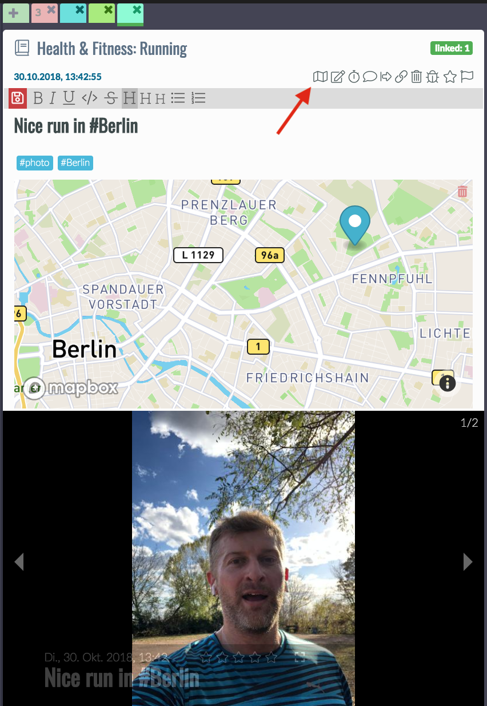
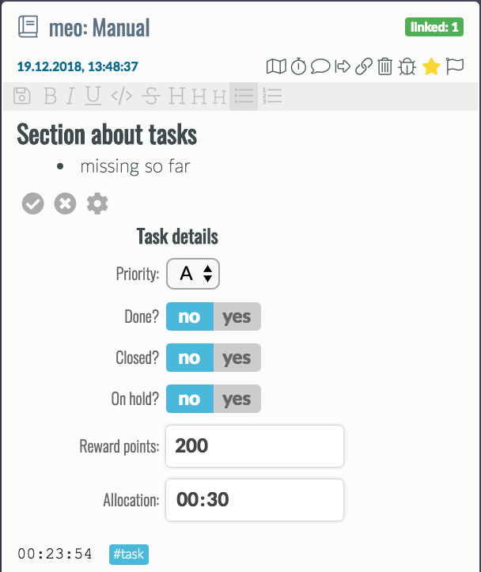
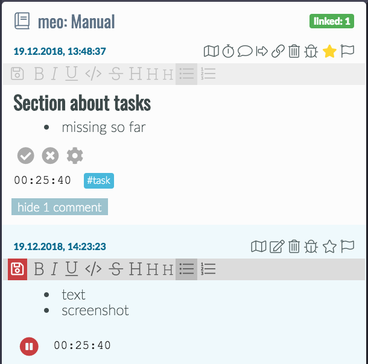
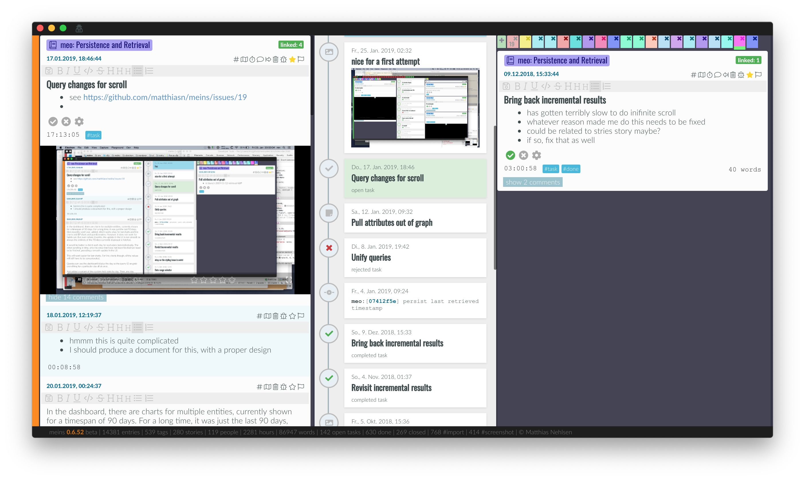
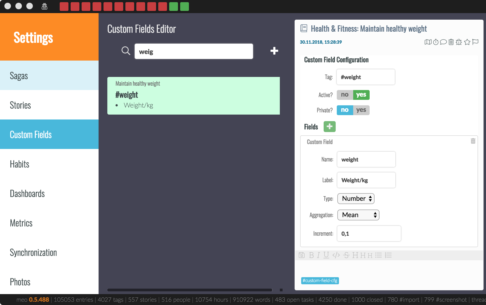
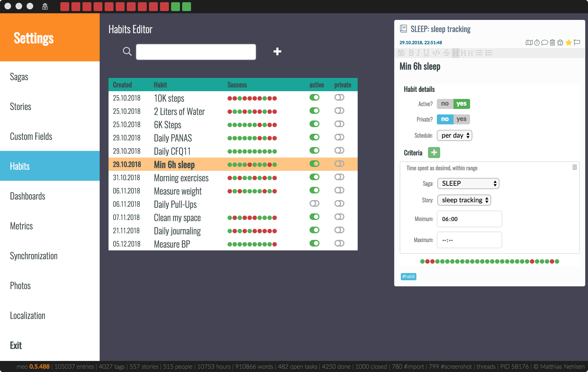
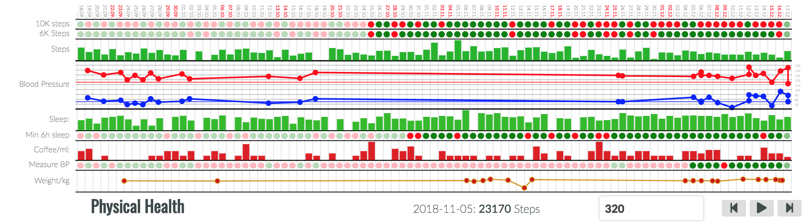

Basic Concepts
==============

Let’s look at the core concepts first, before looking into each of them in detail.

Journal Entries
---------------

Think of it as an **entry in the logbook of a ship**. Only replace the ship with yourself. When available, an entry has your geolocation and associated time zone, the capture time, and whatever you capture. Entries have text, and they can also have attached photos and audio files.

[screenshot of entry with arrows and labels]

They can also capture numeric data and durations in **custom fields**. Custom fields are linked to a **hashtag**, and the data capture section becomes visible after using the respective hashtag in an entry.

There’s also a map section. Also, photos can be imported as entries, and linked to entries as well. Here’s an example:

At the top left of an entry, you can assign a story. A story can be an ongoing thing, for example, a health-related issue such as weight control, or something that has a clear end, such as a vacation. I will explain the details later. Then there is a map view that you can enable and disable with the little action icon that the red arrow is pointing at. I will explain the other action icons later. You can also just try them out, they don't bite. Well, except delete, but that one will ask you if you're sure.

Comments
--------

Entries can have comments. Comments are limited entries, inasmuch as they cannot have entries themselves, or be tasks or the like. Their purpose is to comment on the parent entry. There are two kinds of comments, the **plain comment** and the **timer** comment, see next section.

Tasks
-----

A task is a specialized entry type that, in addition to all the other properties of an entry, has the following extra fields:

- **Priority** - color-coded, from **A** to **E**
- **Done?** - yes or no
- **Closed?** - yes or no
- **On hold?** - yes or no
- **Reward points** - explained later
- **Allocation** - time in hh:mm

There are three ways to create a task:

- You create a tasks by **clicking task  `+`** in the briefing, which creates a tasks and links it with the currently selected day. This is by far my preferred method, it's fast and flags something work on a particular day
- You add the hashtag **#task** in any entry, and it will turn them into a task. This will require the tag to stay in the text. Also, the task will not be linked to a particular day, but only appear in the open tasks list.
- You drag the link icon of any entry onto the briefing for a particular day. This will turn the entry into a task, plus create the link. It can be useful sometimes.

Once created, all open tasks appear in the open tasks list of the briefing, plus, when linked to a day, in the linked tasks section of that day, unless it's already started, because then it only appears in started tasks section. Both finishing a task with **done?** and rejecting with **closed?** will remove the task from all those list, but nothing will ever be deleted, as this is a good part of your journal. Obviously, if you think that what you're doing is so incredibly boring that there is zero chance you will ever want to look at any of this again, that's an actionable data point in and of itself.

You start working on a task by clicking the timer button,which will start a new timer comment, in which I take note of what I am doing and what I still want to achieve. Usually, bullet points work best for me here, whereas I use a plain comment more often for full sentences. But that is just my preference. The time from multiple timers will then be summed up and shown both at the bottom of the parent entry and in the briefing under started tasks, where the color turns to red when I am above my time allocation already.

Focus Mode
----------

While working on a task, and recording the time spent, the user interface is best reduced to show only relevant information and as few distractions as possible. Focus mode only shows the task being worked on, plus a timeline that contains everything from the story that the task belongs to, plus all linked entries. Then on the right side, there's the right journal tab that shows entries from the timeline, or anything else that comes up.

The focus mode can be accessed by having the respective task open in the left column and then clicking **View > Focus Mode** in the menu or via **CMD-F** on Mac and **CTRL-F** on other platforms. You get back with **Escape** or **View > Back to Main View**.

Custom Field
------------

Custom fields let you define what kind of data you want to **capture** when you are using a particular **hashtag**. You need to define this first if you want to plot charts with the data later. For defining custom fields, there is a special entry type. These entries define the custom fields for any particular hashtag. In most cases, you probably want a single field, such as when capturing the amount of coffee consumed, or the number of hours you slept. You can define custom fields in the preferences:

- on Mac: **meins > preferences > Custom Fields**
- on Linux and Windows:  **application > preferences > Custom**

Here, you can select an existing custom fields definition entry, optionally filtered by what you put in the search bar, or you can create a new definition. The first thing you need is a hashtag, such as **#steps**. Tags must start with the hash sign, followed by any number of characters, numbers, underscores, and dashes. This tag, when used in a journal entry, opens a small data capture section at the bottom of an entry, with one pair of label and capture field per line.

In the case of **#steps**, all we need is a single field for the number of steps that were recorded on a given day. However, you can define multiple fields, such as the systolic and the diastolic blood pressure for the **#BP** tag, or duration, distance, altitude gain, and a number of sprints for **#running**, or whatever else you might find interesting - it’s entirely up to you.

Fields must have a name, which can consist of characters, digits, underscores, and dashes, without blank spaces. As a matter of habit, I typically use `cnt` here for something that is countable, `dose` for medication/vitamins/minerals and `vol` for the volume of some liquid such as beer. You can use whatever you like there, though. Then, there is the selector for the type. The available types are `number`, `time`, and `text`. When choosing `number`, you need to select the aggregation. Let me give you an example. When you record four glasses of beer, with 500ml each, you want a result of 2000ml for that given day. This is  `daily sum`. This aggregation is not useful for steps though. Say that during the day, you record multiple times what your current step count is. Now, next time you check, the previously recorded number is already included in the latest count and adding all of them will give you results that are wildly off because with `daily sum`, it would add all of them. Instead, you want `max` to give you the highest number. For say weight, depending on how much of an optimist you are, you may also want to chose `min`, but that's only relevant when you step on the scale more than once a day...

In the custom field definition entry, you can set the field to active or not, where the capture section in an entry won't open if disabled. Also, when set to private, it will only be shown when in the right context.

Then, you can add fields, as described above. A more detailed description will come further below.

Habits
------

A Habit defines a **set of rules** or **success criteria** that unambiguously let **meins** determine if you’ve either succeeded or failed in **achieving something you said you would do**. Sounds complicated​? ...here's an example from my own entries:

- 10K **#steps** per day: if I manage to walk more than 10,000 steps per day, this habit is green, otherwise it is red
- Morning exercises: all of 70 **#sit-ups**, 20 **#push-ups**, 30 **#lunges**, 70s **#plank** – or else it’s red
- Drink 2L of **#water**: if the recorded amount is reached, green, otherwise red

These habits are defined in the preferences in the **Habits** section:

The table shows you the name of the habit, which is the first line of the entry text as you can see in the definition entry on the right. Then, there is the creation date, success & failure for a number of days, and whether the habit is active, and whether it is private. Non-active habits won't be shown. More about private mode later.

In the definition entry, you can add different criteria. The rule is simple: **ALL** need to be fulfilled, **or** it's **RED**.

Dashboard
---------

Above, you saw a dashboard with some of my habits. However, dashboards are more versatile than just habits. Also, the can display information about logged data from custom fields, your blood pressure as a variation on that, and the result of questionnaires.

Dashboards are defined in the preferences as well:

- on Mac: **meins > preferences > Dashboards**
- on Linux and Windows:  **application > preferences > Dashboard**

.. image:: ./images/20181219_1304_pref_dashboards.png

You can select a dashboard or create a new one here. Inside, you find the usual settings for private and active. Then, you can add criteria, or edit existing ones. For example, you can change the color of a chart, as I've done here by changing sleep to some kind of purple, plus making it slightly taller:

.. image:: ./images/20181219_1312_pref_dashboards2.png

More about this later when explaining everything in detail.

Stories
-------

Think of a story as something that has its own timeline. When I query for something inside a story, I only get to see what happened there, without being overwhelmed by unrelated stuff. Stories will also allow for monitoring weekly or daily goals in terms of time spent.

Stories get their own colors, and everything the same story will have the same color, for example in the tabs in the journal, or in the calendar when the time is logged. The colors can be selected in the stories section of the preferences page, which I'll describe in detail later.

Also, the tabs in the two journal sections get grouped together by story.

Sagas
-----

A saga is an overarching kind of story. Stories can belong to a saga, but this is not mandatory. Example from my life are **Health**, **Family**, **Social Life**, **Fitness**, **Career**, **Open source**, plus a few more. These are mostly just meant for organizational purposes, but will become increasingly useful e.g. when looking at time spent in each.

Private mode
------------

There is stuff in my journal that I would not freely share with colleagues, friends, or family. I do however need to be able to open meins when other people are around. Also, I need to be able to take screenshots, for example for this manual, without having to blur out anything.

For this, there is the private mode. This ensures that once activating the little detective button at the top. Then, all the entities described above that do have a private mode switch will be hidden as desired and made safe for work, if you will.

