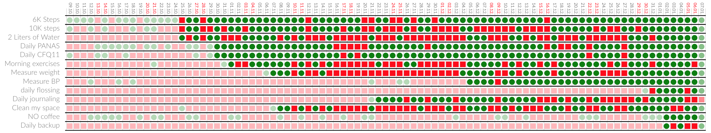

.. meins documentation master file, created by
   sphinx-quickstart on Thu Jan 10 19:11:47 2019.
   You can adapt this file completely to your liking, but it should at least
   contain the root `toctree` directive.

What is meins and how do I use it?
===================================

The Clojure/Script application **meins** is an experimentation tool for **designing your life**. It helps you collect relevant information, design, and then implement change. Most importantly, it does so without leaking data, because everything stays within your realm of control, and you can always verify this claim in the **[source code](https://github.com/matthiasn/meins)**. You start by defining what you want to capture, e.g., how long you **sleep**, how many **steps** you take, how much **beer** you drink. Variables you have some influence on. Then you define **habits**, where a set of rules determines habit success (or failure). Then you record the data or have meins record it for you. A dashboard finally shows you where you **succeed** and where you **fail**. Your only job then is to keep everything **green**, for as long as you possibly can. **Don’t break the chain**, pretty much. Here’s an example of successes and failures for some of the author's habits:

The dots are only fully saturated from the definition of the habit. For some sources, like steps, I have data far further back, imported on the mobile app. On others, I have nothing before the definition, so it does not make sense to show them in the same color, and imply long stretches of failure.

The habits, together with text notes and photos, and time spent, are a part of the journal of your life. After all, you are in large part what you do, and you can capture that in meins, with a timer that you keep running while you're working on anything.

Besides, I reserve say fifteen minutes a day for some text about how I am doing and how things are going. I created a habit to monitor that, see the second last line above. Maybe not surprisingly, compliance has gone up after I put this dashboard in plain view, and that’s my general experience. The habits work by far best when I’m forced to look at them, and meins happily shines daylight on the things I said I would do.

.. toctree::
   :hidden:

   overview
   concepts
   motivation
   privacy
   storage

Indices and tables
==================

* :ref:`search`
