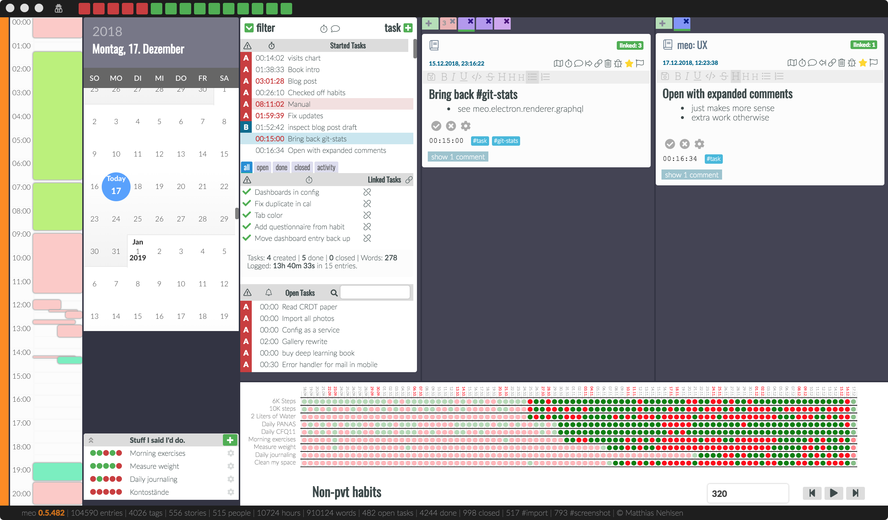
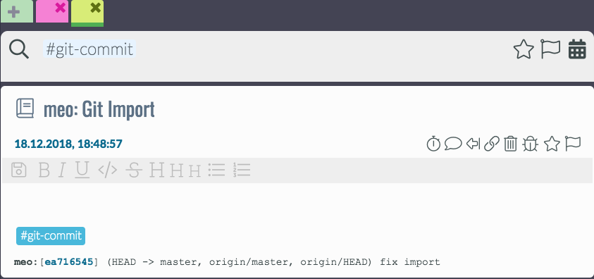
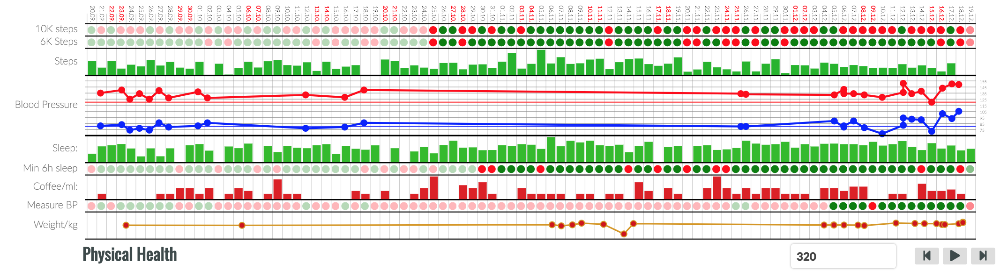

Overview
========

The main view of the application currently looks like this:

On the far left, the **calendar view** shows recorded time. Most of the time is user-recorded, as in, starting a timer while completing a task, or recording something that already happened with the **#duration** tag. However, there is an integration with Apple Health. This allows the meins app to read this data, and import for example sleep duration and the number of steps and stairs per day, or also blood pressure and pulse. This mobile app is not quite ready for beta testing; please reach out though if you think you can help in one way or another. The are many different things to do, including helping me get this React Native application work on Android as well.

The next column right shows an **infinitely scrolling calendar** where you can select the current day. Below that is a list of habits I committed to and that are still open for today. Each of them shows the success for the past 5 days including today and disappears once successfully completed for the day.

At the top of the application window, the **success of the habits** is shown differently, giving me a reason to celebrate as more and more of the squares become green. When moving the mouse over one of the squares, you get a view of the last 30 days.

In the next column, which is the **briefing** for the day, a list of tasks that are in progress is shown. Here, I recommend limiting work in progress to anywhere between three and ten tasks. More about that later.

Below, there are **tasks for the selected day**. These can either be open or finished or rejected. In-progress tasks do not appear here, as they are already shown directly above. Below that is a searchable list for **all your open tasks**.

The next and last two columns are the actual **journal**, each with the result of a journal entry search, and showing them in a timeline view with the newest one on top, as we have become accustomed to from social media. You can choose if you want one or two of these columns, see "Toggle Split View" in the view menu. However, I hardly ever use one column as I find it too handy to have both available. With two columns, I can look for something in one while recording the process of something in the other. If no tab view with a search field is there, you can add a tab pressing the large `add tab` button. Here, you can search for hashtags and mentions, like this:

Also, you can add a story to the search using `$` before starting to type a substring match from the story name. You can also select a date range if you want to narrow down the results by clicking on the calendar at the right of the search bar:

.. image:: ./images/20181219_1046_search.png

In theory, you would also be able to do a full-text search, but that is currently broken, see
`issue #17 <https://github.com/matthiasn/meins/issues/17>`. Help is much appreciated.

Below briefing and entry timeline view, there is the **dashboard**. One way I think of it is a **banner ad for information about myself** that, insofar as if I choose the right information, it helps me improve something in my life. What information you choose is entirely up to you, and showing even seemingly random data source can be interesting, and useful to spot connections.

Then, since I come back often to track progress on my tasks or take notes of one kind or another, I see this banner ad  and, even if subconsciously, might do something I said I would, like do my push-ups or whatnot.

I found that these banner ads about myself have a **better impact on my life** than those banner ads the Internet forces me to look at every day. Here's another one, with a combination of habit completions and captured data:

